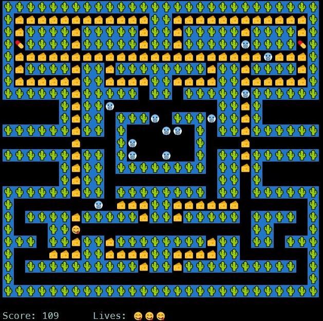

# PacMan: Go Implementation

## Introduction

- This project is the clone of the classic PacMan game in Go.
- The aim was to get introduced to go programming language and learn its synatx and few subtle features. This is my first project in Go.
- The code is the result of the tutorial by @danicat on [PacGo](https://github.com/danicat/pacgo).

## Things Learnt

- Basic Go syntaxes and exceution methods.
- The use of special keyword like defer.
- Different types of function declarations.
- Error Handling.
- Commandline Arguments.
- JSON and text File Reading.
- Use of go-routines and communication with them.
- Handling the critical section problems using different types of locks.

## Result

